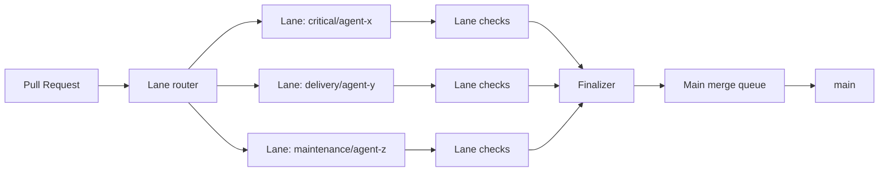

# Issue #1661 Design Spec: Merge Bottleneck — Per-Agent Lanes

- **Issue:** [#1661](https://github.com/IBuySpy-Shared/basecoat/issues/1661)
- **Related findings:** `docs/audit/ci-cd-findings-2026-06-14.md` (Learning 1)
- **Status:** Design phase (Sprint 36)
- **Target implementation window:** Sprint 37+

## Problem statement

BaseCoat currently routes all pull requests through one effective merge path to `main`.
When one high-risk or flaky PR blocks queue progress, unrelated low-risk work stalls.
This creates head-of-line blocking and hides true throughput by forcing manual overrides.

## Goals

1. Isolate merge contention so one agent's failures do not block unrelated agents.
2. Preserve a single integrity point for `main` while enabling parallel admission.
3. Define clear gate ownership: global compliance gates versus lane-specific quality gates.
4. Keep operating overhead low enough for one platform team to manage.

## Non-goals

1. Replacing GitHub merge queue internals.
2. Removing global compliance gates.
3. Immediate migration of every workflow in one release.

## Design decisions

### 1. Lane model

Use **logical per-agent lanes** backed by a small set of operational tiers:

| Tier | Lane key pattern | Typical agents | Merge SLA target |
| --- | --- | --- | --- |
| Tier 0 (critical) | `lane-critical/<agent>` | security, release, incident-response | `< 2h` |
| Tier 1 (delivery) | `lane-delivery/<agent>` | frontend-dev, backend-dev, product-manager | `< 8h` |
| Tier 2 (maintenance) | `lane-maintenance/<agent>` | docs, cleanup, dependency lifecycle | `< 24h` |

Each agent receives a dedicated logical lane key (`<tier>/<agent>`), but tooling and
dashboards are managed per tier to avoid operational explosion.

### 2. Routing and scheduling

Adopt a **two-stage merge flow**:

1. **Lane admission stage (parallel):** PRs are grouped by lane key and validated with lane-specific checks.
2. **Main finalization stage (serialized):** one ready candidate at a time enters `main` merge queue.

This removes head-of-line blocking between lanes while preserving linear and auditable integration on `main`.



### 3. Gate partitioning

| Gate type | Scope | Examples | Failure effect |
| --- | --- | --- | --- |
| Global mandatory | All lanes | secrets scan, branch policy, commit message validation | Blocks finalizer admission |
| Tier mandatory | Per tier | CI matrix for code lanes, deployment checks for critical lanes | Blocks that tier/agent lane only |
| Lane advisory | Per agent lane | optional extended tests, cost/perf diagnostics | Does not block finalizer admission |

### 4. Concurrency keys and fairness

Use lane-specific concurrency groups for admission and one global group for finalization:

- Admission workflow concurrency: `merge-lane-${tier}-${agent}`
- Finalizer workflow concurrency: `merge-finalizer-main`

Fairness policy: weighted round-robin by tier with anti-starvation floor (each non-empty lane is scheduled at least once every N cycles).

## Proposed lane routing contract

Define `lane_router` metadata for each agent:

```yaml
lane_router:
  tier: delivery
  lane: frontend-dev
  required_checks:
    - validate-unix
    - validate-windows
    - code-review-agent
  advisory_checks:
    - docs-link-check
```

If an agent has no explicit mapping, default to `tier: maintenance` and `lane: shared`.

## Observability and operations

Track these metrics per tier and per lane:

1. Queue wait time (p50/p95)
2. Lane admission failure rate
3. Finalizer success rate
4. Starvation events (age > SLA)
5. Manual override count

Initial cost estimate (incremental):

| Component | Estimated monthly cost |
| --- | --- |
| Additional workflow minutes (lane admission checks) | +10% to +18% |
| Dashboards + alerting maintenance | ~4 engineer-hours/month |
| On-call/triage overhead | ~2 engineer-hours/month after stabilization |

## Rollout plan

1. **Phase A (pilot, 1-2 weeks):** Enable Tier 0 and one Tier 1 lane for two agents.
2. **Phase B (expand, 2 weeks):** Migrate remaining delivery agents; tune fairness.
3. **Phase C (generalize, 2 weeks):** Migrate maintenance lanes and enforce global policy.
4. **Phase D (hardening):** Alerting SLOs, docs finalization, and operational runbook updates.

## Success criteria (design acceptance)

- [x] Lane topology and routing contract defined
- [x] Global versus lane gate split defined
- [x] Concurrency/fairness strategy defined
- [x] Cost and operational impact estimated
- [x] Phased rollout plan defined

## Implementation handoff

Planned implementation work should reference this design and #1661:

1. Add `lane_router` metadata to targeted agents/workflows.
2. Introduce `merge-lane-scheduler` and `merge-finalizer` workflows.
3. Update merge queue docs and deployment scripts with lane-aware keys.
4. Add queue fairness and starvation alerts.
