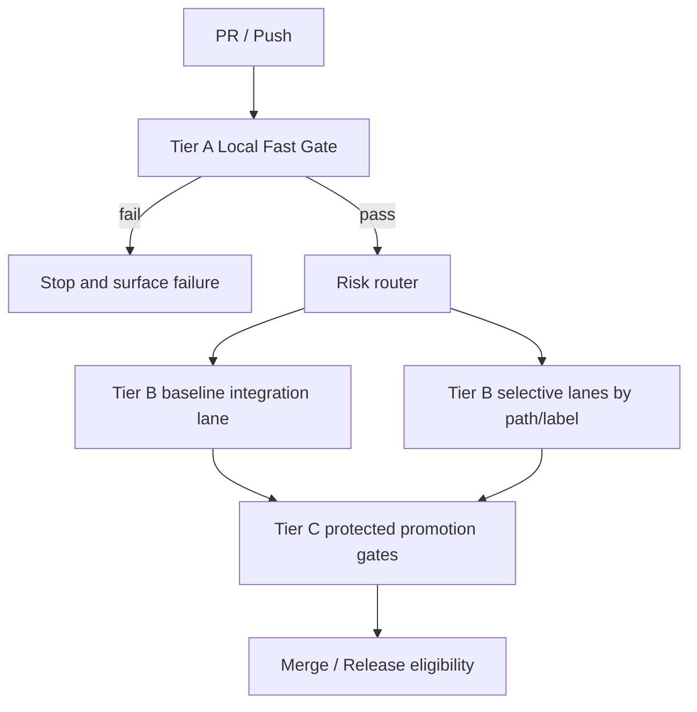

<!-- markdownlint-disable MD013 -->

# Local + Cloud Testing Workflows Design

**Issue**: #1665  
**Related finding**: `docs/audit/ci-cd-findings-2026-06-14.md` (Learning #5)  
**Status**: Design complete (implementation deferred to follow-up issues)

---

## Problem Statement

BaseCoat currently lacks a consistent pattern for separating fast local verification from slower cloud validation. Teams either run too little before opening PRs (causing avoidable CI churn) or run everything in cloud on every change (causing long feedback loops and high queue time).

The result is unstable cycle time: fast iteration is possible, but not predictable. We need a deterministic model where low-latency checks always run first, expensive checks run only when warranted, and both environments stay behaviorally aligned.

---

## Design Decisions

### Decision 1: Split checks into three gate tiers

Use a strict tier model with increasing cost and confidence:

| Tier | Where it runs | Budget target | Purpose | Typical checks |
| --- | --- | ---: | --- | --- |
| **Tier A: Local Fast Gate** | Developer machine + PR bootstrap job | 3-8 min | Catch obvious failures quickly | format/lint, unit tests, schema/frontmatter validation, docs strict build |
| **Tier B: Cloud Selective Gate** | Cloud CI (conditional) | 8-25 min | Validate integration-risk changes | integration tests, matrix/runtime coverage, dependency/security scans, contract tests |
| **Tier C: Cloud Promotion Gate** | Protected branch/release workflows | 15-45+ min | Release confidence before merge/deploy | end-to-end suites, deployment smoke checks, environment/policy approvals |

This resolves debate question 1 by explicitly assigning lightweight deterministic checks to local/early CI, and expensive/high-signal checks to cloud tiers.

### Decision 2: Cloud gates are conditional on local gate success

Cloud selective gates should execute only when Tier A passes. This prevents wasted cloud compute on changes that fail basic quality checks and shortens queue pressure for the whole repository.

Trigger model:

1. Run Tier A for every PR and push.
2. If Tier A fails, stop workflow and return actionable failures.
3. If Tier A passes, evaluate change-risk routing:
   - always run baseline Tier B integration lane
   - add specialized Tier B lanes only when relevant paths/labels are touched (for example: workflow changes, security-sensitive paths, MCP/infrastructure code)
4. Tier C remains branch/release protected and never bypasses required approvals.

This answers debate question 2: yes, cloud gates are conditional, with required protected gates preserved.

### Decision 3: Keep local and cloud environments in sync via shared test contract

Use one contract definition for both environments:

1. **Single command entrypoints**: local and cloud both call the same scripts (`tests/run-tests.ps1`, `scripts/validate-basecoat.ps1`, docs build command), not duplicated command strings.
2. **Pinned toolchain**: lock Node/Python/tool versions in repo and in CI setup actions.
3. **Parity artifact**: publish a machine-readable test manifest (gate name -> command -> timeout -> required paths) consumed by local wrappers and workflows.
4. **Drift detection**: add periodic parity checks that compare local manifest vs workflow execution matrix and fail on mismatch.
5. **Failure taxonomy**: classify failures as local-only, cloud-only, or parity failures to route ownership fast.

This answers debate question 3 by making parity a first-class design constraint rather than best effort.

---

## Proposed Workflow Topology

Routing inputs for selective lanes:

- Changed paths (`.github/workflows/**`, `mcp/**`, `agents/**`, `skills/**`, `instructions/**`)
- Labels (`security`, `dependencies`, `infra`, `release-risk`)
- Manual override (`full-cloud-validation` label or workflow dispatch flag)

---

## Guardrails and Non-Goals

### Guardrails

- Tier A is mandatory for all contributions.
- Tier B cannot run when Tier A fails.
- Tier C remains mandatory for protected branches/releases.
- Manual override to force full cloud validation is allowed; manual bypass of required gates is not.

### Non-Goals

- This design does not define provider-specific runner infrastructure.
- This design does not replace release approval policies.
- This design does not introduce new test frameworks; it orchestrates existing validation assets.

---

## Rollout Plan

1. **Phase 1 - Define parity manifest**: codify existing checks into tiered manifest and map current workflows.
2. **Phase 2 - Enforce conditional Tier B routing**: gate cloud selective jobs behind Tier A result and path/label router.
3. **Phase 3 - Add drift detection + observability**: parity audit job, queue-time and rerun dashboards.
4. **Phase 4 - Tune thresholds**: adjust routing based on flake rates, median cycle time, and false-positive risk.

---

## Success Criteria

- [ ] Median PR feedback time for first failure is reduced by at least 30%.
- [ ] At least 80% of PRs avoid full-cloud runs when change-risk is low.
- [ ] No increase in post-merge regression rate after conditional gating rollout.
- [ ] Environment drift incidents are detected automatically within 24 hours.
- [ ] Required protected-branch gates remain fully enforced.

---

## Related Links

- Finding source: `docs/audit/ci-cd-findings-2026-06-14.md`
- Debate/design template: `docs/audit/issue-design-template.md`
- Adjacent CI/CD design context: `docs/design/ci-cd-workflow-templatization.md`

<!-- markdownlint-enable MD013 -->
