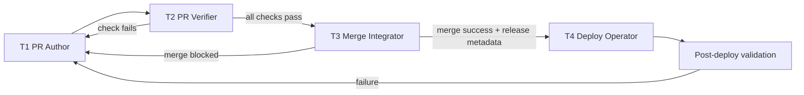

# PR-Only Agent Responsibility Model

This design resolves issue #1663 by separating agent responsibilities across the
delivery lifecycle so failures are contained and ownership is explicit.

## Problem

Current automation mixes PR authorship, review, merge, and deployment in the
same execution path. One failure mode can block the entire flow and creates
ambiguous accountability for quality and release risk.

## Decisions

### 1. Operational definition of PR-only agents

A **PR-only agent** is an automation actor that may:

- create or update a branch
- open or update a pull request
- post evidence in PR comments/checks
- request reviewers and apply non-protected labels

A PR-only agent may **not**:

- merge to protected branches
- deploy to any environment
- bypass required checks or branch protection
- change repository governance or secrets

### 2. Transition from PR to deployment

PR work transitions to deployment only when all of the following are true:

1. Required status checks are green.
2. Required human approvals are present.
3. Risk classification is resolved (Tier 1/2/3 from governance policy).
4. Release notes / traceability metadata is attached to the PR.

When any gate fails, control returns to PR-only repair loops; deployment agents
must not proceed.

### 3. Responsibility tiers (separate agent types)

Yes, separate agent types are required. The model uses four tiers:

| Tier | Agent Type | Scope | Direct write authority |
|---|---|---|---|
| T1 | PR Author | Branch + PR authoring, patch updates | Feature branch only |
| T2 | PR Verifier | Policy/evidence checks, risk scoring, review comments | PR checks/comments |
| T3 | Merge Integrator | Queue orchestration and merge execution after approvals | Protected merge only |
| T4 | Deploy Operator | Environment promotion and rollback workflows | Environment-scoped deploy controls |

No tier can execute another tier's high-risk actions. Cross-tier handoff must be
machine-visible through status checks and PR metadata.

## Lifecycle flow

## Guardrails

- Serialized merge pacing remains required.
- Tier 3 and Tier 4 actions require explicit policy evaluation before execution.
- Deployment workflows must reference the merged PR and commit SHA for audit.
- Emergency/manual overrides require documented rationale in issue/PR history.

## Success criteria

- Median PR cycle time improves without reducing required checks.
- Cross-lane failure blast radius is reduced (one lane failure does not stall all).
- Fewer reopen events caused by unclear ownership at merge/deploy boundaries.
- 100% of deployment runs map back to a merged PR and issue.

## Rollout plan

1. Add tier tags and ownership metadata to existing agent workflows.
2. Enforce tiered gates in branch protection and workflow permissions.
3. Migrate mixed-responsibility workflows to T1/T2 first, then T3/T4.
4. Publish monthly scorecard for velocity, gate pass rate, and rollback rate.

## Related references

- `docs/audit/ci-cd-findings-2026-06-14.md`
- `docs/operations/keep-fix-throttle-model.md`
- `docs/reference/governance.md`
