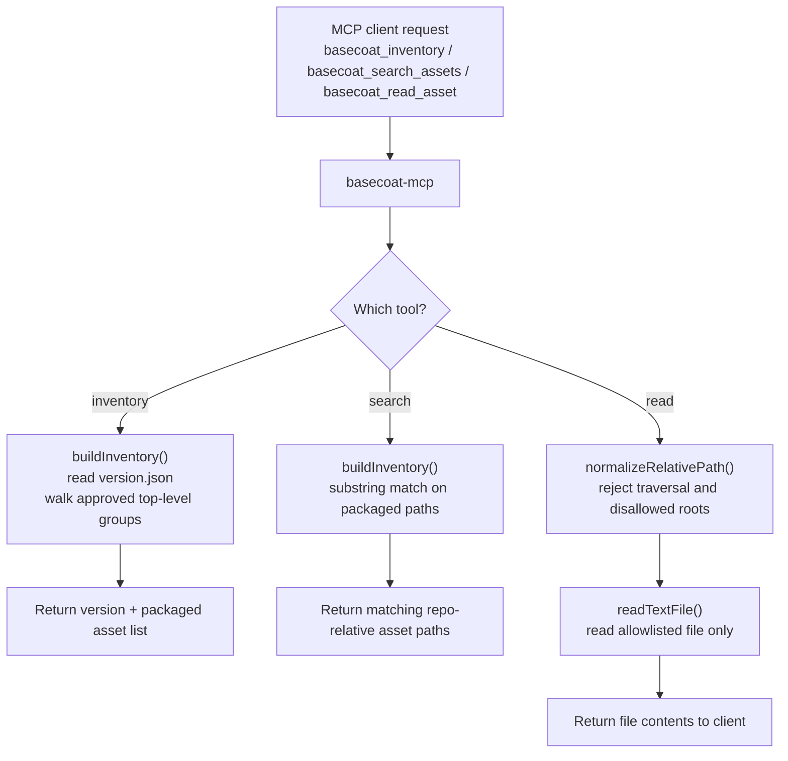
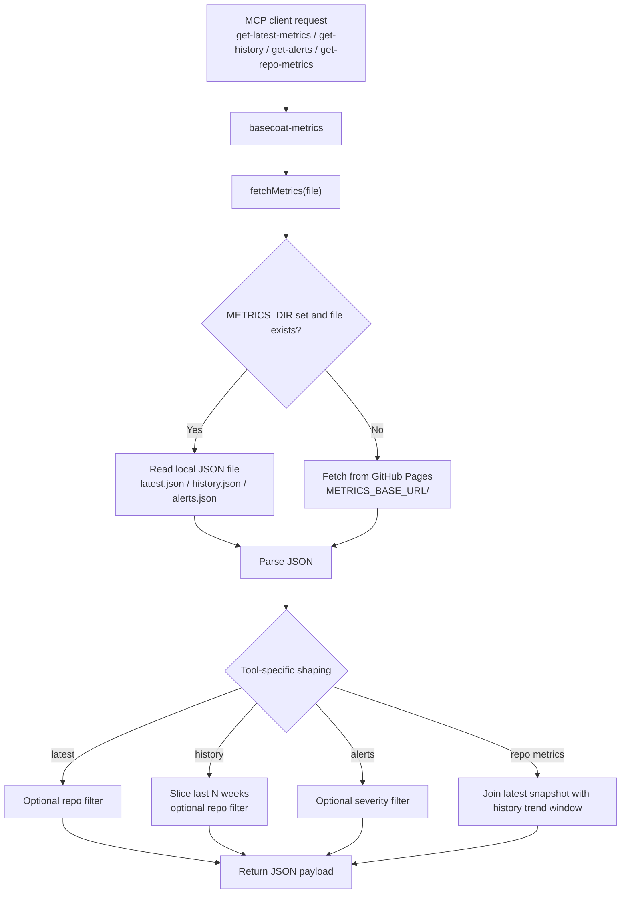

# BaseCoat MCP and Metrics Data Flow

This diagram breaks the read paths into the two flows that matter most in day-to-day
use: catalog asset access in `basecoat-mcp`, and metrics retrieval in
`basecoat-metrics`.

- Source files: `mcp/index.js`, `mcp/basecoat-metrics/src/index.ts`

## 1. Asset catalog read path

## 2. Metrics fetch path

## 3. Notes

1. The catalog path stays inside the repo and relies on path normalization plus an
   allowlist of top-level directories and files before any read occurs.
2. The metrics path is read-only in both modes. The only runtime switch is whether
   the JSON source is local (`METRICS_DIR`) or remote (`METRICS_BASE_URL`).
3. `basecoat-metrics` also exposes optional repo asset discovery tools when
   `REPO_DIR` is configured, but those are a supplemental read path and do not
   replace the primary `basecoat-mcp` catalog flow.
