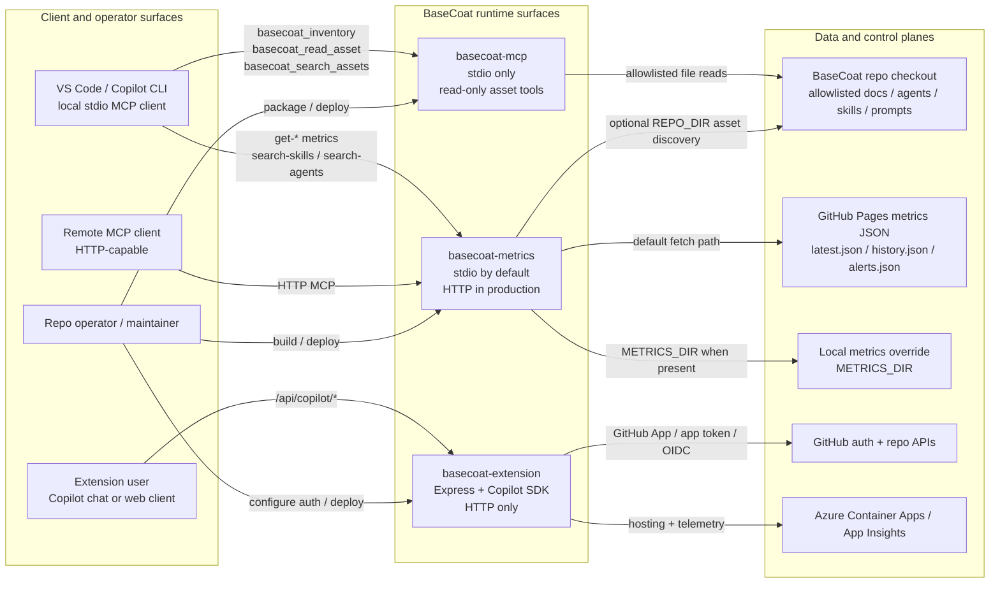

# BaseCoat MCP Topology and Extension Surface

This diagram maps the three MCP-adjacent runtime surfaces currently shipped in the
repository and shows which data planes and trust boundaries each one can cross.

- Source files: `mcp/index.js`, `mcp/basecoat-metrics/src/index.ts`,
  `mcp/basecoat-extension/src/server.ts`

## 1. Component topology

## 2. Reading guide

1. `basecoat-mcp` is the narrowest surface: it only speaks stdio and only reads
   allowlisted repo content through `basecoat_inventory`, `basecoat_read_asset`,
   and `basecoat_search_assets`.
2. `basecoat-metrics` is the transport bridge. It serves the metrics tools over
   stdio for local clients and over HTTP when deployed, while keeping its data
   path read-only.
3. `basecoat-extension` is a separate HTTP application, not a drop-in replacement
   for the read-only MCP servers. It adds authenticated and gated write-tool
   behavior on top of the Copilot SDK runtime.

## 3. Trust boundaries

- **Repo boundary**: `basecoat-mcp` and the optional asset-discovery tools in
  `basecoat-metrics` can only read files inside the repo roots they normalize and
  allowlist.
- **Metrics boundary**: `basecoat-metrics` reads JSON from GitHub Pages by default
  and only switches to local files when `METRICS_DIR` is set explicitly.
- **Write boundary**: the extension surface introduces GitHub-authenticated
  operations, confirmation handshakes, rate limiting, and observability, so it
  should be treated as a higher-trust HTTP service rather than a passive catalog.
