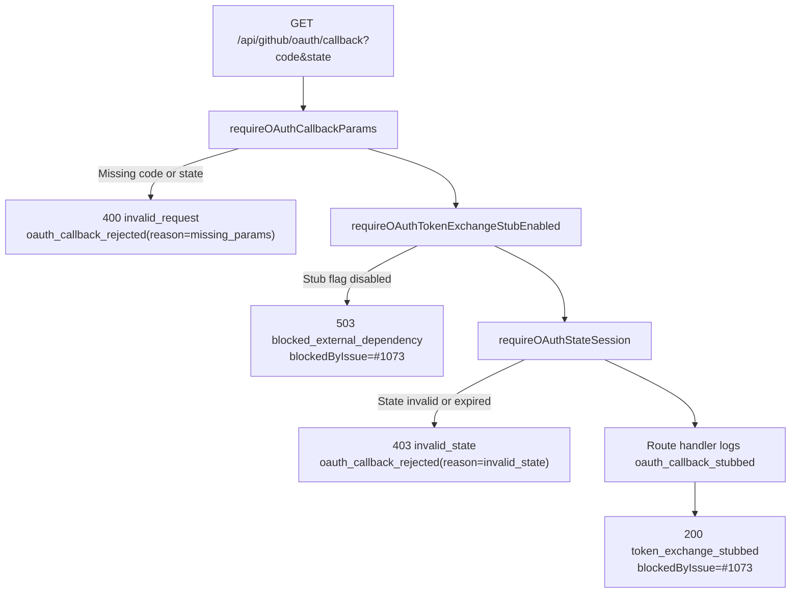
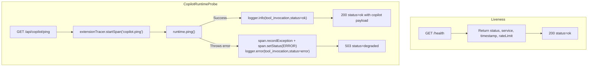

# Copilot Extension OAuth and Tool Invocation Request Flow

Request-flow reference for the BaseCoat Copilot Extension runtime.

- Source of truth: `mcp/basecoat-extension/src/app.ts`
- Integration entrypoint: `mcp/basecoat-extension/README.md`

---

## 1. OAuth callback pipeline (`GET /api/github/oauth/callback`)



---

## 2. Tool execution path (`POST /api/copilot/tools/:toolName`)

```mermaid
flowchart TD
    A["POST /api/copilot/tools/:toolName"] --> RL["createRateLimiter() via app.use('/api/copilot', ...)"]
    RL --> B["parseToolName(req.params.toolName)"]
    B -->|Unknown toolName| B_404["404 error=unknown_tool<br/>logger.warn(tool_invocation)"]
    B --> C["writeTools.execute(toolName, req.body)"]
    C -->|result.status=error and errorCode=unknown_tool| C_404["404 result payload"]
    C -->|result.status=error (other)| C_400["400 result payload"]
    C -->|result.status=blocked| C_503["503 result payload"]
    C -->|result.status=ok or needs_confirmation| C_200["200 result payload<br/>logger.info(tool_invocation)"]
```

---

## 3. Health and ping path (`GET /health`, `GET /api/copilot/ping`)



---

## Assumptions

1. OAuth callback token exchange remains intentionally stubbed behind `BASECOAT_EXTENSION_ENABLE_OAUTH_TOKEN_EXCHANGE_STUB=true` until issue #1073 is unblocked (as documented in runtime responses).
2. Tool response branches are based on `WriteToolService.execute(...)` status values in current runtime behavior (`error`, `blocked`, `ok`, `needs_confirmation`).
3. `/health` is liveness-only; tracing and Copilot dependency checks are intentionally done on `/api/copilot/ping`.
