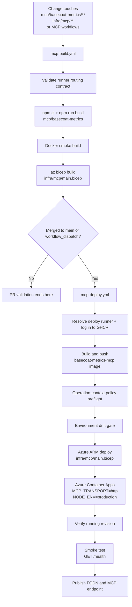

# MCP Metrics Build and Deploy Flow

This diagram shows the CI/CD path that currently exists for the deployable metrics
server and its Azure Container Apps target.

- Source files: `.github/workflows/mcp-build.yml`,
  `.github/workflows/mcp-deploy.yml`, `infra/mcp/main.bicep`

## 1. CI and deployment flow

## 2. Reading guide

1. `mcp-build.yml` is the fast feedback gate: compile TypeScript, build the Docker
   image once, and lint the Bicep template.
2. `mcp-deploy.yml` turns a successful main-branch or manual run into a GHCR image,
   then deploys that image through `infra/mcp/main.bicep` after policy and drift
   checks pass.
3. The container app is configured for HTTP ingress only, which is why the deployed
   metrics service exposes `/health` and a shared remote MCP endpoint.

## 3. Scope note

The deploy flow above applies to `basecoat-metrics`. The root `mcp/` package remains
a local stdio package with a Docker wrapper and self-test, but it is not deployed by
`mcp-build.yml` or `mcp-deploy.yml` in the current repository layout.
