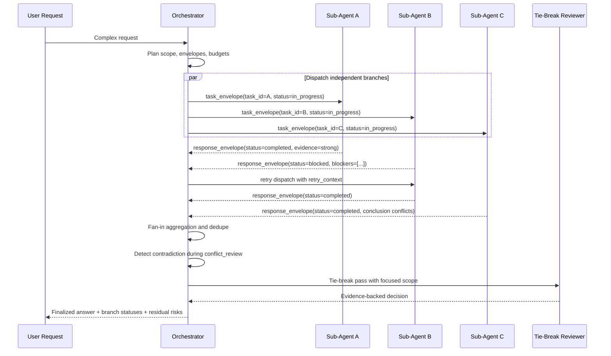
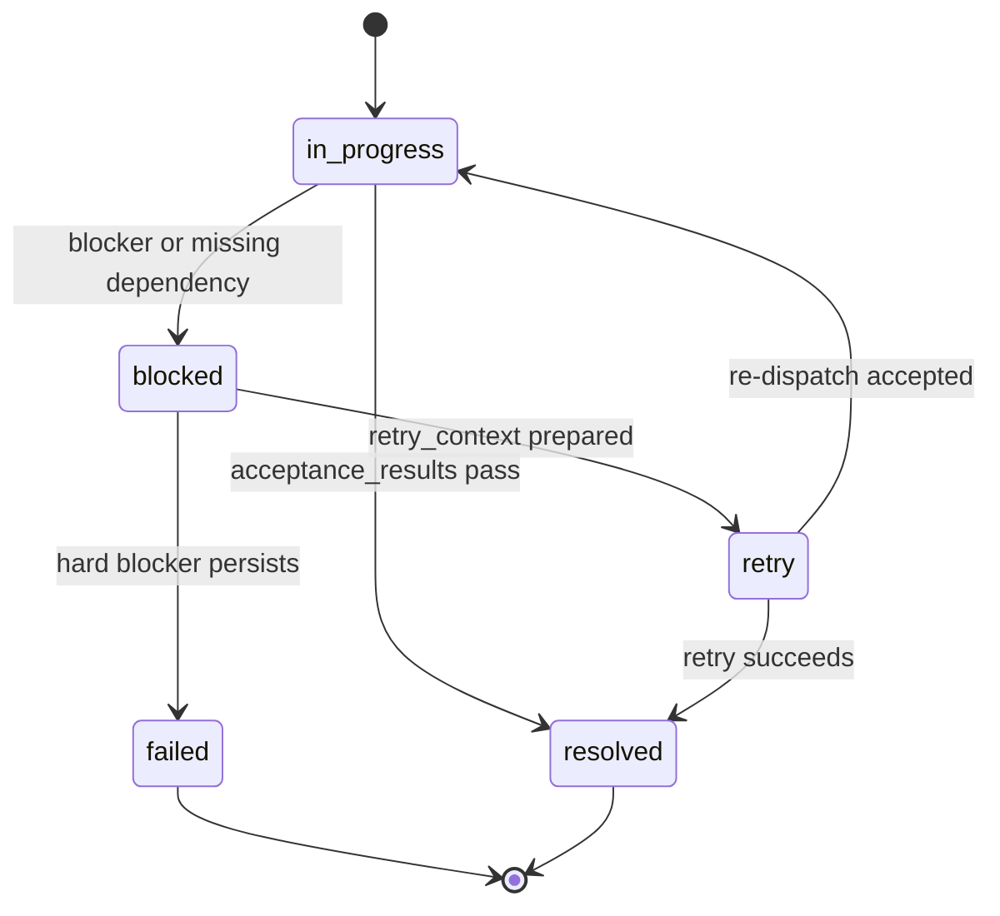
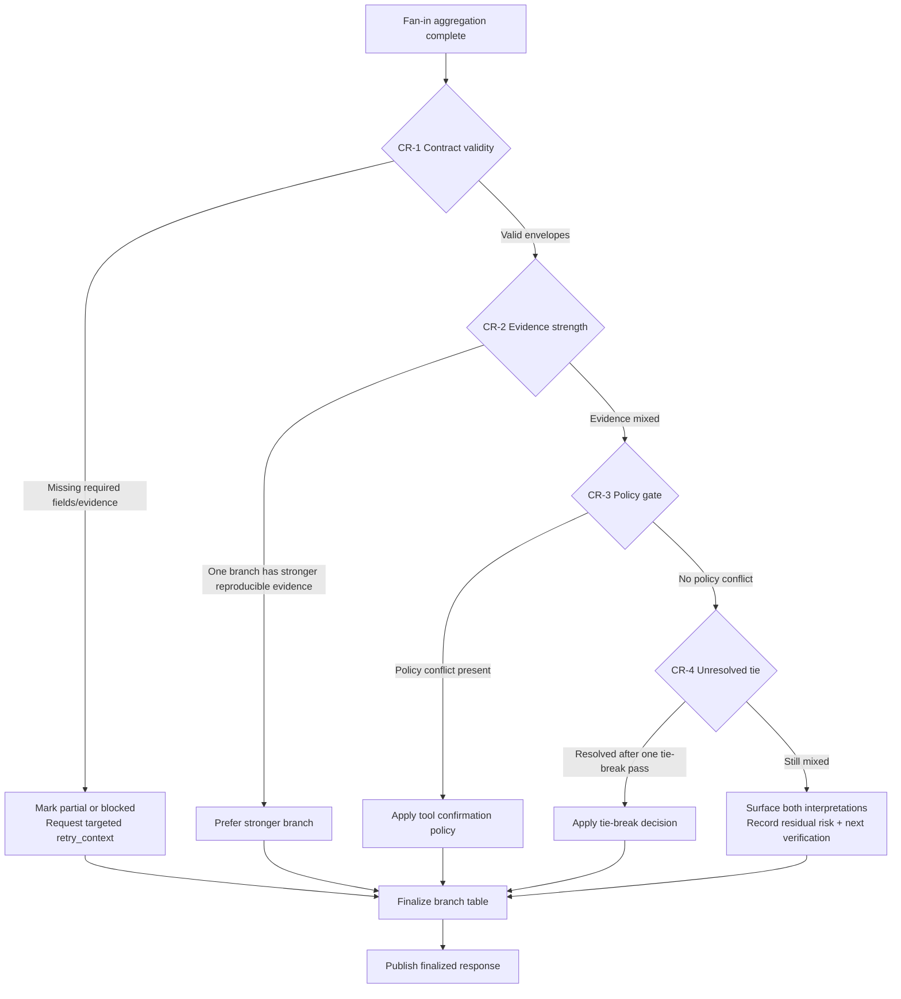

# Orchestrator Dispatch, Fan-In, and Conflict Resolution Flow

Visual reference for orchestrator fan-out/fan-in execution and tie-break handling.

- Primary source terminology:
  `agents/basecoat-10-core-orchestrator.agent.md` and
  `docs/agents/multi-agent-workflows.md`

## 1. Subtask Dispatch and Fan-In Sequence

## 2. Branch Status Lifecycle

## 3. Conflict-Resolution Decision Flow

