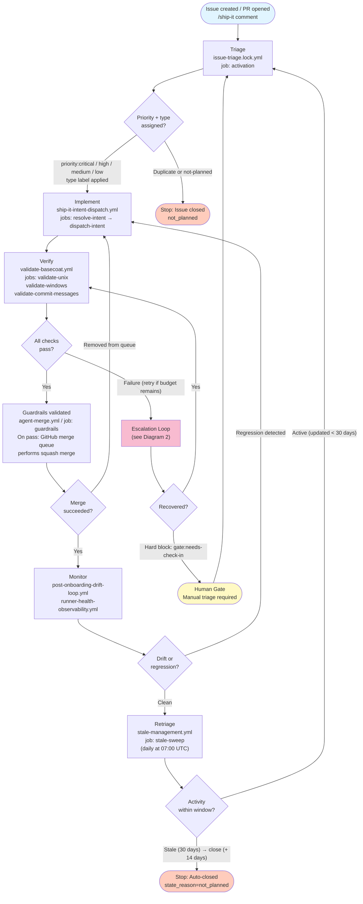
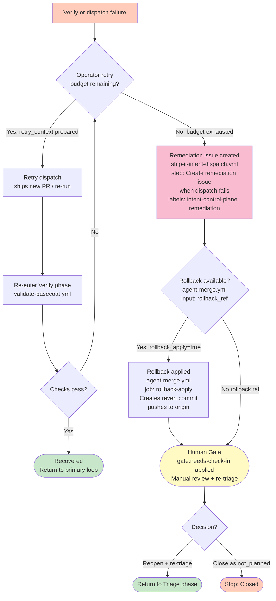
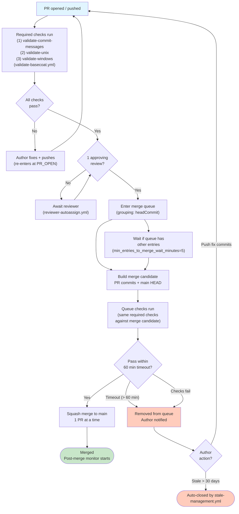

<!-- markdownlint-disable MD041 -->
## Workflow Loop Architecture and Control Points

Visual reference for BaseCoat's recurring control loops, escalation paths, and merge pacing.

- Primary source anchors:
  - `.github/workflows/ship-it-intent-dispatch.yml` (intent dispatch and remediation)
  - `.github/workflows/validate-basecoat.yml` (verify gate: `validate-unix`, `validate-windows`, `validate-commit-messages`)
  - `.github/workflows/agent-merge.yml` (guardrails, rollback)
  - `.github/workflows/stale-management.yml` (retriage, staleness sweep)
  - `docs/operations/merge-queue-enforcement.md` (merge queue parameters)
  - `docs/agents/multi-agent-workflows.md` (fleet merge pacing)

---

## 1. Primary Workflow Loop

The core delivery cycle spans six phases. Each phase is backed by one or more workflows.
Stop conditions and timeout boundaries are marked at every exit that terminates the loop.

### Loop boundaries

| Phase | Entry condition | Stop / exit |
|---|---|---|
| Triage | Issue created or reopened | Closed as duplicate / not_planned |
| Implement | Type + priority label applied | — (feeds Verify) |
| Verify | PR ready for review | Hard failure → Escalation Loop |
| Merge | All required checks green | Removal from queue → re-implement |
| Monitor | Squash merge to `main` | Regression → re-implement |
| Retriage | Daily schedule | 30-day stale mark → 14-day auto-close |

---

## 2. Escalation Loop

Captures the failure → retry → fallback → human-gate path wired into
`ship-it-intent-dispatch.yml` and `agent-merge.yml`.

### Control points

| Signal | Trigger | Action |
|---|---|---|
| `steps.dispatch.outcome == 'failure'` | `ship-it-intent-dispatch.yml` | Create or update remediation issue with `intent-control-plane` + `remediation` labels |
| `rollback_ref` input provided | `agent-merge.yml` | Generate rollback patch |
| `rollback_apply=true` | `agent-merge.yml` job `rollback-apply` | Create revert commit and push to origin |
| `gate:needs-check-in` label | Any gate decision | Pause loop; require human triage |
| `gate:no-tests` label | Queue gate | Hold PR; request test coverage before re-queue |

---

## 3. Merge / Queue Loop

Serialized merge pacing from the [merge queue enforcement policy](../operations/merge-queue-enforcement.md).
Parameters: `max_entries_to_merge=1`, `grouping_strategy=headCommit`, merge method `squash`.

### Timeout and retry boundaries

| Boundary | Value | Source |
|---|---|---|
| Queue check timeout | 60 min | `check_response_timeout_minutes: 60` |
| Max concurrent builds | 5 | `max_entries_to_build: 5` |
| Merge batch size | 1 | `max_entries_to_merge: 1` |
| Batch wait window | 5 min | `min_entries_to_merge_wait_minutes: 5` |
| Stale mark threshold | 30 days | `stale-management.yml` `STALE_DAYS` |
| Stale close threshold | +14 days | `stale-management.yml` `CLOSE_DAYS` |
| Required status check jobs | `validate-commit-messages`, `validate-unix`, `validate-windows` | `validate-basecoat.yml` |

---

## Assumptions

1. Retry attempt counting is operator-managed; no workflow tracks cross-run attempt counts internally. Operators should inspect the remediation issue comment history to determine retry depth before exhausting the budget.
2. `gate:needs-check-in` and `gate:no-tests` labels are applied by queue gate logic documented in `agents/basecoat-60-workflow-queue-rebalancer.agent.md`.
3. Stale exemptions apply: items labelled `pinned`, `security`, or `do-not-close` are skipped by `stale-management.yml`.
4. The merge queue is scoped to `refs/heads/main`; `release/*` branches are not yet enrolled (see `docs/operations/merge-queue-enforcement.md`).

## Intended operator usage

1. **Primary loop**: Use Diagram 1 to orient yourself when a delivery stalls — identify which phase the work is in, check the corresponding workflow run, and decide whether to retry, escalate, or close.
2. **Escalation loop**: Use Diagram 2 when a remediation issue appears. Confirm the attempt count, check `rollback_ref` availability in `agent-merge.yml`, and apply `gate:needs-check-in` to park the loop for human triage.
3. **Merge/queue loop**: Use Diagram 3 when PRs are sitting in the queue unexpectedly. Check queue check timeout (60 min), verify required checks are green, and confirm merge queue configuration has `max_entries_to_merge: 1` to avoid race conditions.
4. **Stale recovery**: If work was auto-closed, reopen the issue with updated context to reset the activity window and re-enter the triage phase.
