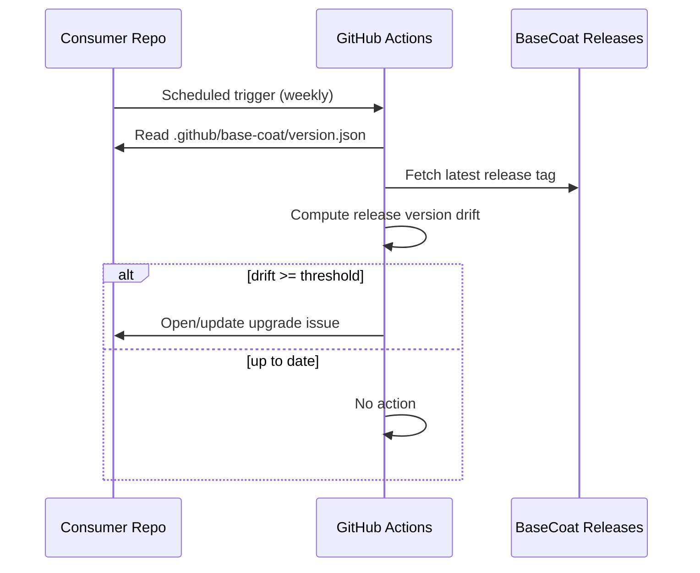

# Version Drift Detection

BaseCoat provides a callable workflow that consumer repos can schedule to detect when their synced assets are out of date.
Release-version drift remains the default signal, with optional asset-level drift available via
`asset-manifest.json` and the adoption scanner.

## How it works



## Setup

Copy this to `.github/workflows/check-basecoat-version.yml` in your consumer repo:

```yaml
name: Check BaseCoat Version
on:
  schedule:
    - cron: '0 9 * * 1'
  workflow_dispatch:
jobs:
  check:
    uses: YOUR-ORG/basecoat/.github/workflows/check-basecoat-version-callable.yml@main
    with:
      stage_path: .github/base-coat
      alert_threshold: 1
      source_repo: YOUR-ORG/basecoat
    permissions:
      issues: write
      contents: read
```

## Inputs

| Input | Default | Description |
|---|---|---|
| `stage_path` | `.github/base-coat` | Path to synced BaseCoat assets |
| `alert_threshold` | `1` | Versions behind before alerting |
| `source_repo` | Required | Source BaseCoat repository in `owner/repo` format |

## Choosing an alert threshold (N versions)

Set `alert_threshold` to match your upgrade policy:

| Policy | `alert_threshold` | Expected behavior |
|---|---:|---|
| Strict | `0` | Alert as soon as any version drift is detected |
| Recommended | `1` | Alert when at least one version behind |
| Relaxed | `2` | Alert only when two or more versions behind |

Example (recommended baseline):

```yaml
jobs:
  check:
    uses: YOUR-ORG/basecoat/.github/workflows/check-basecoat-version-callable.yml@main
    with:
      stage_path: .github/base-coat
      alert_threshold: 1
      source_repo: YOUR-ORG/basecoat
```

## What the issue looks like

When drift is detected, an issue is opened in the consumer repo titled:

> `chore: BaseCoat upgrade available (v3.23.0 → v3.25.0)`

The issue includes the current version, latest version, and upgrade instructions. If the issue already exists, a comment is added instead (idempotent).

## Auditability and evidence

For an auditable version-alignment trail in consumer repos:

1. Keep the callable workflow on a schedule (weekly is a common baseline).
2. Preserve the generated drift issue(s) instead of deleting/recreating them.
3. Link each upgrade PR to the corresponding drift issue.

You can trace drift checks with:

```bash
gh run list --workflow check-basecoat-version.yml --limit 10
gh issue list --search "BaseCoat upgrade available" --state all
```

## Asset-level drift (optional)

To evaluate per-asset version/SHA drift across consumer repos:

```powershell
pwsh scripts/adoption/detect-basecoat.ps1 -Org YOUR-ORG -OutputFormat markdown -AssetDetail
```

When a source asset has frontmatter `version`, the scanner compares source vs consumer version.
When version metadata is unavailable, it falls back to SHA drift comparison.
