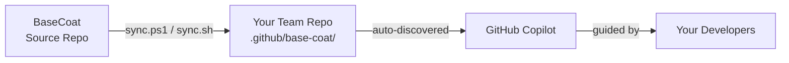

# BaseCoat

**Versioned GitHub Copilot customization library for enterprise repos.**

BaseCoat gives your organization one place to manage agents, skills, instructions, and prompts. Sync it into each team repo with a single command so standards stay consistent and reusable instead of being rewritten in every codebase.

- [README.md](../README.md) — Getting started, installation, and overview
- [CHANGELOG.md](../CHANGELOG.md) — Release history
- [CONTRIBUTING.md](../CONTRIBUTING.md) — Contribution guide
- [philosophy.md](philosophy.md) — Design philosophy and principles

---

## What's included

| Asset type | Count | What it does |
|---|---|---|
| **Agents** | 130 | End-to-end task executors — sprint planners, code reviewers, security analysts, and more |
| **Skills** | 135 | Reusable domain capabilities invoked by agents |
| **Instructions** | 91 | Copilot behavior rules scoped by file path pattern |
| **Prompts** | 6 | Structured templates for repeatable tasks |

---

## How it works

1. **Sync** — pull the latest BaseCoat release into `.github/base-coat/`
2. **Use** — Copilot auto-discovers agents, instructions, and prompts from `.github/`
3. **Contribute** — open a PR to share patterns back with the org

---

## Explore the docs

- [integrations/mcp-deployment.md](integrations/mcp-deployment.md) — Deploying the Base Coat MCP server
- [integrations/pydantic-mcp-integration.md](integrations/pydantic-mcp-integration.md) — Pydantic + MCP integration
- [integrations/pydantic-typescript-client-generation.md](integrations/pydantic-typescript-client-generation.md) — TypeScript client generation
- [integrations/azure-ad-integration-guide.md](integrations/azure-ad-integration-guide.md) — Azure AD integration
- [integrations/azure-sql-migration-guidance.md](integrations/azure-sql-migration-guidance.md) — Azure SQL migration
- [integrations/enterprise-identity-access.md](integrations/enterprise-identity-access.md) — Identity & access patterns
- [integrations/enterprise-kubernetes-patterns.md](integrations/enterprise-kubernetes-patterns.md) — AKS / K8s guidance
- [integrations/application-gateway-routing-guidance.md](integrations/application-gateway-routing-guidance.md) — App Gateway routing
- [integrations/rbac-only-authentication-patterns.md](integrations/rbac-only-authentication-patterns.md) — RBAC auth patterns
- [integrations/untools-integration.md](integrations/untools-integration.md) — UnTools integration guide

## Reference (`docs/reference/`)

- [GOVERNANCE.md](GOVERNANCE.md) — Canonical governance landing page for shared vs repo-specific rules
- [reference/governance-contract.md](reference/governance-contract.md) — Canonical common-vs-specific governance guide
- [reference/inventory.md](reference/inventory.md) — Full asset listing (agents, skills, instructions, prompts)
- [reference/repository-inventory.md](reference/repository-inventory.md) — Current counts, model assignments, and token-budget snapshot
- [reference/governance.md](reference/governance.md) — Contribution policies and review standards
- [reference/distribution.md](reference/distribution.md) — Sync mechanism for consumer repos
- [reference/hooks.md](reference/hooks.md) — Git hooks and pre-commit validation
- [reference/goals.md](reference/goals.md) — Project goals and OKRs
- [reference/ai-sdlc-operating-model.md](reference/ai-sdlc-operating-model.md) — Canonical Guardrails vs Visibility operating model
- [reference/scoped-instructions.md](reference/scoped-instructions.md) — Scoped instruction authoring guide
- [reference/label-taxonomy.md](reference/label-taxonomy.md) — GitHub label taxonomy
- [reference/prompt-registry.md](reference/prompt-registry.md) — Prompt catalog and registry
- [reference/prompt-library.md](reference/prompt-library.md) — Generated examples for every intent, skill, and agent
- [reference/asset-registry.md](reference/asset-registry.md) — Asset registry metadata
- [reference/cli-command-reference.md](reference/cli-command-reference.md) — CLI command reference
- [reference/component-library.md](reference/component-library.md) — Component library reference
- [reference/product.md](reference/product.md) — Product definition reference and downstream onboarding guide
- [reference/quick-reference.md](reference/quick-reference.md) — Quick reference card
- [reference/guidance-vocabulary-syntax-guide.md](reference/guidance-vocabulary-syntax-guide.md) — Canonical vocabulary, taxonomy, ontology, and prompt syntax
- [reference/treatment-matrix.md](reference/treatment-matrix.md) — Issue treatment matrix
- [reference/fleet-loop-adoption-scorecard.md](reference/fleet-loop-adoption-scorecard.md) — Fleet audit findings: policy vs implementation vs live behavior across consumer repos
- [reference/documentation-accuracy-audit.md](reference/documentation-accuracy-audit.md) — Page-by-page current-code accuracy review register
- [reference/guardrails/](reference/guardrails/) — Guardrail configuration files
- [diagrams/architecture-diagrams-index.md](diagrams/architecture-diagrams-index.md) — Visual reference index for architecture, dispatch, and validation flows

## Guides (`docs/guides/`)

- [guides/intent-prefixes.md](guides/intent-prefixes.md) — Intent vocabulary, routing behavior, and prompt templates
- [guides/token-optimization.md](guides/token-optimization.md) — Operator token-efficiency checklist, model/mode defaults, and context normalization patterns
- [guides/cost-aware-prompting-playbook.md](guides/cost-aware-prompting-playbook.md) — Tactical model/session/delegation rules for long-running advanced CLI workflows
- [guides/phase-boundary-session-checklist.md](guides/phase-boundary-session-checklist.md) — Command-level `/compact` vs `/new` checklist across cleanup, implementation, RCA, and docs pivots
- [agents/taxonomy.md](agents/taxonomy.md) — Agent and skill taxonomy with chain archetypes

## Operations (`docs/operations/`)

- [operations/fleet-dispatch-policy.md](operations/fleet-dispatch-policy.md) — Guardrails and checklist for parallel sub-agent dispatch in fleet mode
- [operations/session-per-task.md](operations/session-per-task.md) — Policy for issue-scoped dedicated sessions and cross-session handoffs
- [operations/label-cleanup-plan.md](operations/label-cleanup-plan.md) — Safe label normalization plan that preserves repo-specific labels
- [operations/hybrid-branching-policy-contract.md](operations/hybrid-branching-policy-contract.md) — Hybrid branch taxonomy, transition matrix, agent lane contract, and rollout scorecard guardrails
- [operations/release-process.md](operations/release-process.md) — How releases are cut and published
- [operations/release-metrics.md](operations/release-metrics.md) — Release metrics and KPIs
- [operations/operational-runbook.md](operations/operational-runbook.md) — Runbook for common operations
- [operations/disaster-recovery.md](operations/disaster-recovery.md) — DR procedures
- [operations/cost-optimization.md](operations/cost-optimization.md) — Cost analysis and optimization
- [operations/enterprise-runners.md](operations/enterprise-runners.md) — Self-hosted runner setup
- [operations/enterprise-security-hardening.md](operations/enterprise-security-hardening.md) — Security hardening guide
- [operations/blocked-issues.md](operations/blocked-issues.md) — Blocked issues tracking
- [operations/telemetry-adoption.md](operations/telemetry-adoption.md) — Adoption telemetry guide
- [operations/repo-story.md](operations/repo-story.md) — Durable chronicle of execution learnings and cycle updates
- [operations/github-secrets.md](operations/github-secrets.md) — Repository secrets setup and rotation guide
- [operations/copilot-extension-github-app-registration.md](operations/copilot-extension-github-app-registration.md) — GitHub App registration runbook for BaseCoat Copilot Extension
- [operations/build-master-control-plane.md](operations/build-master-control-plane.md) — Build master architecture, policy matrix, and runbook for lane-aware continuous merge with cloud break-fix
- [operations/security/remediation-traceability-workflow.md](operations/security/remediation-traceability-workflow.md) — Canonical implementation-linked closure workflow for security remediation
- [operations/security/](operations/security/) — Security policies and audit docs

## Templates (`docs/templates/`)

- [templates/](templates/) — File templates and scaffold taxonomy guidance

## Examples (`docs/examples/`)

- [examples/](examples/) — Read-only examples and starter references

## Archive

> Historical Wave 3 staging deliverables, portal design docs, wireframes, and cleanup reports.
> These are preserved for reference but are not part of the active framework.

- [View archive on GitHub](https://github.com/IBuySpy-Shared/basecoat/tree/main/docs/archive) — All archived Wave 3, portal, design, and audit documents
