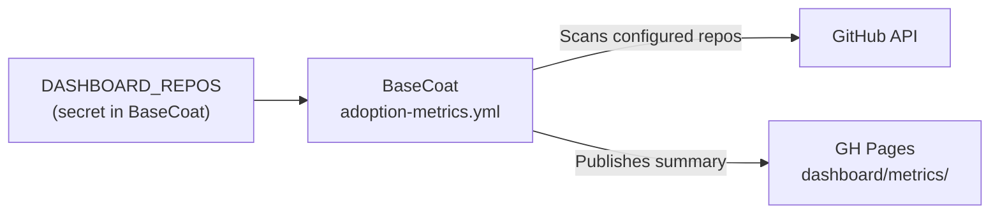

# Adoption Metrics

Live weekly snapshot of BaseCoat adoption across consumer repositories — asset
coverage, version currency, and onboarding trends.

[Open Dashboard :material-open-in-new:](../dashboard/){ .md-button .md-button--primary target=_blank }

---

## What the dashboard tracks

| Metric | Description |
|---|---|
| **Consumer count** | Repositories that have adopted the BaseCoat overlay |
| **Version currency** | % of consumers on the latest release vs. drifted |
| **Asset coverage** | Which asset types (agents / skills / instructions / prompts) each consumer has synced |
| **Onboarding rate** | New consumers added per sprint |
| **Drift alerts** | Consumers more than one minor version behind |

## How metrics are collected

The `adoption-metrics.yml` workflow runs weekly (and can be run manually) in the
BaseCoat repo. It reads the monitored repository list from `DASHBOARD_REPOS`,
collects adoption data directly through the GitHub API, and publishes outputs to
`dashboard/metrics/` on `gh-pages`.



## Data retention

Metrics snapshots are stored in the `gh-pages` branch under `dashboard/metrics/`.
Each weekly run appends a JSON record. The dashboard retains 52 weeks of history.

Weekly output also includes CI reliability signals per repository in both
`latest.json` and `SUMMARY.md`:

- `success_rate` (backward-compatible, based on last 100 measurable runs)
- `pass_rate` (alias of `success_rate`)
- `ci_pass_rate_last_20_runs` (retrospective-focused pass rate window)

For a complete field-level contract, definitions, and interpretation guidance, see
[Dashboard Metrics Schema and Glossary](reference/metrics-schema-glossary.md).

## Canonical vocabulary

Use canonical telemetry terms from
[Dashboard Metrics Schema and Glossary](reference/metrics-schema-glossary.md#canonical-vocabulary-and-usage-rules),
especially when writing docs, issues, and summaries for adoption telemetry:

- **Dashboard monitored repository** for `DASHBOARD_REPOS` configuration
- **Dashboard participating repository** for repos present in current outputs
- **Telemetry artifact** for files in `dashboard/metrics/`

## Onboard a dashboard monitored repository

Use this flow to opt a repository into dashboard monitoring.

1. Configure monitored repos via `DASHBOARD_REPOS` in `IBuySpy-Shared/basecoat`.

```bash
echo '["IBuySpy-Shared/basecoat","org/repo1","org/repo2"]' | gh secret set DASHBOARD_REPOS --repo IBuySpy-Shared/basecoat
```

1. Run the workflow.

```bash
gh workflow run adoption-metrics.yml --repo IBuySpy-Shared/basecoat
```

1. Verify dashboard outputs.

```bash
gh run list --workflow adoption-metrics.yml --repo IBuySpy-Shared/basecoat --limit 1
gh run watch --repo IBuySpy-Shared/basecoat
```

Then confirm updated files under `dashboard/metrics/` on `gh-pages`
(`latest.json`, `history.json`, `alerts.json`, `SUMMARY.md`).

!!! tip "Helper script"
    Use `pwsh scripts/bootstrap-dashboard.ps1` to list/add/remove monitored repos
    without manually editing secret JSON.

## Enrollment decision table

| Need | Use | Config location | Trigger |
|---|---|---|---|
| Include repositories in adoption dashboard metrics | Dashboard monitored repos | `DASHBOARD_REPOS` secret in `IBuySpy-Shared/basecoat` | `adoption-metrics.yml` (schedule or manual run) |
| Include repositories in weekly memory candidate sweep | Memory-sweep enlistment | GitHub topic `basecoat-enabled` on each repository | `memory-sweep.yml` (Monday schedule) |
