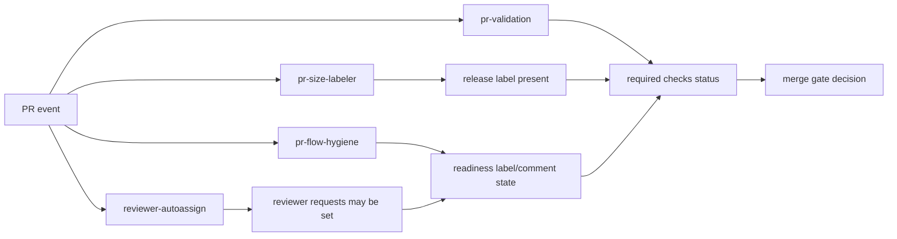

# Workflow Control Plane Reference

This section documents the BaseCoat PR control-plane workflows that govern merge readiness.

## Scope

The pages in this section cover:

- Flow (what the workflow does and in what order)
- Entrance conditions (trigger and required preconditions)
- Exit conditions (what marks pass/fail/no-op)
- Schedule (if any)
- Inputs, environment variables, repository variables, and secrets

## System flow

## Distribution boundary: what stays in BaseCoat vs consumers

| Category | Lives in BaseCoat source repo | Synced to consumers by `sync.sh` / `sync.ps1` |
|---|---|---|
| PR control-plane workflows (`.github/workflows/pr-*.yml`) | Yes | No |
| Repo governance automation and checks | Yes | No |
| Copilot assets (`agents/`, `skills/`, `instructions/`, `prompts/`) | Yes | Yes |
| Managed workflow assets under `.github/base-coat/workflows/` | Yes | Yes (to `.github/base-coat/workflows/`) |
| Intake templates (PR/issue) | Yes | Seeded when missing |

## Workflow pages

- [PR Validation](pr-validation.md)
- [PR Flow Hygiene](pr-flow-hygiene.md)
- [PR Size and Sprint Labeler](pr-size-labeler.md)
- [Reviewer Auto-Assign](reviewer-autoassign.md)
