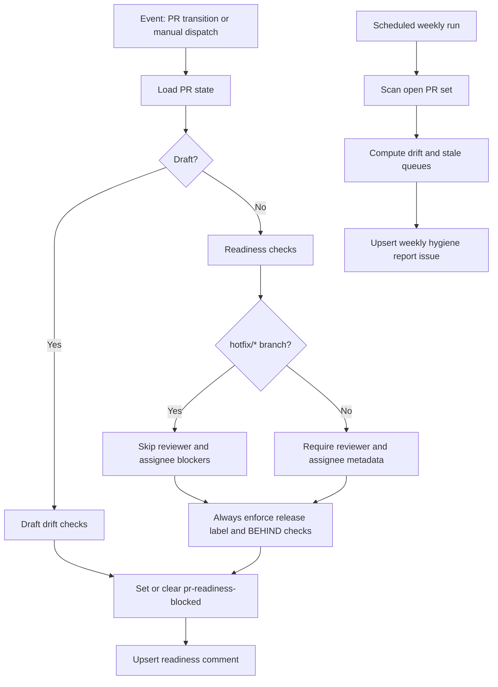

# PR Flow Hygiene Workflow

Workflow file: `.github/workflows/pr-flow-hygiene.yml`

## Purpose

Maintains PR readiness state and weekly lifecycle hygiene reports.

## Flow

## Entrance

| Item | Value |
|---|---|
| Trigger | `pull_request_target` (`ready_for_review`, `synchronize`, `reopened`, `review_requested`, `review_request_removed`, `assigned`, `unassigned`, `labeled`, `unlabeled`) |
| Schedule | `0 13 * * 1` (weekly) |
| Manual trigger | `workflow_dispatch` |
| Concurrency | `${{ github.workflow }}-${{ github.ref }}` with `cancel-in-progress: true` |
| Permissions | `contents: read`, `issues: write`, `pull-requests: write` |

## Exit

| Path | Exit condition |
|---|---|
| Event-driven readiness mode | Label/comment updated to match current readiness evaluation |
| Weekly hygiene mode | Weekly report issue created or updated |
| Fail | Cannot resolve target PR in event/manual mode, or API call failures |

## Inputs

| Input | Type | Default | Required | Purpose |
|---|---|---|---|---|
| `pr_number` | string | none | No | Manual targeted PR evaluation on selected ref |
| `wip_limit` | string | `20` | No | Max ready-for-review PRs before breach |
| `draft_drift_days` | string | `14` | No | Draft drift threshold |
| `ready_stale_days` | string | `7` | No | Ready PR inactivity threshold |
| `max_items` | string | `200` | No | Open PR scan cap |

## Variables and secrets

No explicit repository variables or external secrets are required. The workflow uses GitHub-provided token context through `actions/github-script`.

Environment variables used by the script:

| Name | Source |
|---|---|
| `PR_NUMBER_INPUT` | `inputs.pr_number` |
| `WIP_LIMIT` | `inputs.wip_limit` |
| `DRAFT_DRIFT_DAYS` | `inputs.draft_drift_days` |
| `READY_STALE_DAYS` | `inputs.ready_stale_days` |
| `MAX_ITEMS` | `inputs.max_items` |

## Hotfix fast-path behavior

For `hotfix/*` branch PRs, readiness evaluation skips:

- missing reviewer blocker
- missing assignee blocker

It still enforces:

- release/planning label presence
- `mergeable_state == behind` blocker

## Job-level entry and exit contract

| Job | Entry | Success exit | Failure exit |
|---|---|---|---|
| `hygiene` | Any configured trigger | Readiness state reconciled or weekly report published | Script fails to resolve PR, parse settings, or call required APIs |
