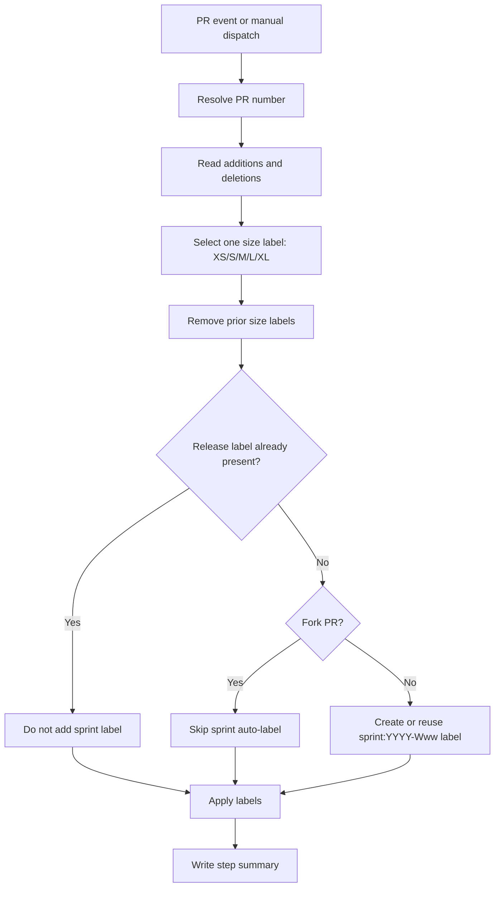

# PR Size and Sprint Labeler Workflow

Workflow file: `.github/workflows/pr-size-labeler.yml`

## Purpose

Applies deterministic size labels and ensures a release-planning label exists on PRs.

## Flow

## Entrance

| Item | Value |
|---|---|
| Trigger | `pull_request_target` (`opened`, `synchronize`, `reopened`, `ready_for_review`) |
| Manual trigger | `workflow_dispatch` with `pr_number` |
| Concurrency | `${{ github.workflow }}-${{ github.event.pull_request.number \|\| github.ref }}` |
| Permissions | `contents: read`, `issues: write`, `pull-requests: write` |

## Exit

| Path | Exit condition |
|---|---|
| Pass | Size label reconciled and optional sprint label logic completed |
| No-op | PR already has release label; sprint auto-label skipped |
| Fail | PR number cannot be resolved or label API calls fail |

## Schedule

No `schedule` trigger.

## Inputs

| Input | Type | Required | Purpose |
|---|---|---|---|
| `pr_number` | number | Yes for manual dispatch | Target PR to label |

## Variables and secrets

| Type | Name | Used by |
|---|---|---|
| Env | `PR_NUMBER_INPUT` | Manual dispatch PR resolution |

No external secrets are required.

## Label outputs

| Label family | Behavior |
|---|---|
| `size:*` | Exactly one active size label based on line churn |
| `sprint:*` / `wave:*` | If one already exists, no new sprint label is added |
| `sprint:YYYY-Www` | Auto-created and applied only when missing release label and PR is not from a fork |
