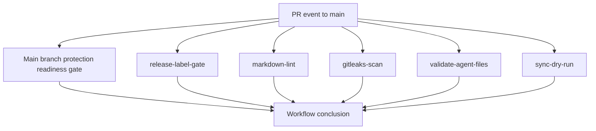

# PR Validation Workflow

Workflow file: `.github/workflows/pr-validation.yml`

## Purpose

Runs deterministic PR checks and policy gates for pull requests targeting `main`.

## Flow

## Entrance

| Item | Value |
|---|---|
| Trigger | `pull_request` on `main` (`opened`, `synchronize`, `reopened`, `ready_for_review`, `labeled`, `unlabeled`) |
| Manual trigger | `workflow_dispatch` |
| Concurrency | `${{ github.workflow }}-${{ github.ref }}` with `cancel-in-progress: true` |
| Permissions | `contents: read`, `pull-requests: read` |

## Exit

| Path | Exit condition |
|---|---|
| Pass | All enabled jobs pass |
| Fail | Any required job exits non-zero |
| Advisory pass | `main-branch-protection-readiness` warns and exits `0` when classic protection API returns 404 (rulesets advisory mode) |

## Schedule

No `schedule` trigger.

## Inputs

No workflow inputs.

## Variables and secrets

| Type | Name | Used by |
|---|---|---|
| Env | `GH_TOKEN` (`github.token`) | API checks in branch protection and release-label jobs |
| Env | `REPOSITORY` (`github.repository`) | Main branch protection readiness |
| Repo var | `BASECOAT_POLICY_PACK` (`vars.BASECOAT_POLICY_PACK`) | Main branch protection readiness |
| Env | `GITLEAKS_VERSION` | Gitleaks install step |
| Env | `GITHUB_TOKEN` (`github.token`) | Sync dry-run auth |
| Env | `GH_TOKEN` (`github.token`) | Sync dry-run auth |
| Env | `BASECOAT_SOURCE_REPO` | Sync dry-run source repo |
| Env | `BASECOAT_SOURCE_REF` | Sync dry-run source ref |

## Job-level entry and exit contract

| Job | Entry | Success exit | Failure exit |
|---|---|---|---|
| `main-branch-protection-readiness` | PR or manual run | Branch protection baseline validated, or advisory 404 path | Missing policy file, invalid policy pack, strict/context checks fail |
| `release-label-gate` | PR labels available | Release label pattern found, or explicit skip label | Missing release label and no skip label |
| `markdown-lint` | Markdown files changed | Lint passes or no markdown changes | Lint/install/fetch failure |
| `gitleaks-scan` | Repo checkout complete | Scan completes; warns on findings | Tool install/runtime failure |
| `validate-agent-files` | Agent files present | Structure contract satisfied | Required sections/frontmatter missing |
| `sync-dry-run` | Temp repo initialized | Sync script runs and expected files exist | Sync or file assertions fail |
