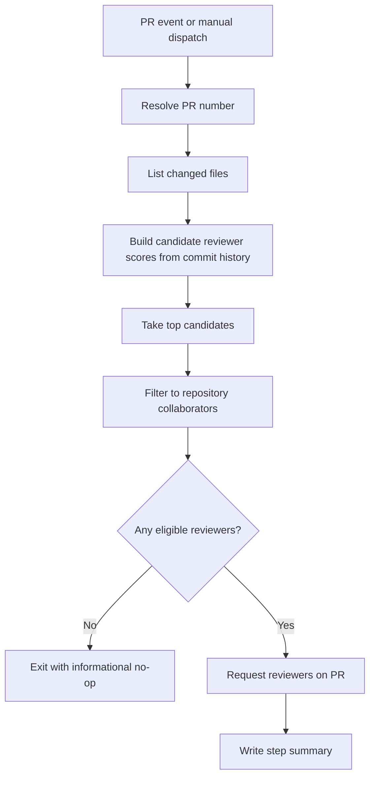

# Reviewer Auto-Assign Workflow

Workflow file: `.github/workflows/reviewer-autoassign.yml`

## Purpose

Requests reviewers based on path ownership history while preventing non-collaborator review requests.

## Flow

## Entrance

| Item | Value |
|---|---|
| Trigger | `pull_request_target` (`opened`, `synchronize`, `reopened`, `ready_for_review`) |
| Manual trigger | `workflow_dispatch` with `pr_number` |
| Concurrency | `${{ github.workflow }}-${{ github.event.pull_request.number || github.ref }}` |
| Permissions | `contents: read`, `pull-requests: write` |

## Exit

| Path | Exit condition |
|---|---|
| Pass | Reviewers requested successfully |
| No-op | No changed files, no candidates, or no eligible collaborators |
| Fail | PR number resolution fails or API errors propagate |

## Schedule

No `schedule` trigger.

## Inputs

| Input | Type | Required | Purpose |
|---|---|---|---|
| `pr_number` | number | Yes for manual dispatch | Target PR to evaluate |

## Variables and secrets

| Type | Name | Used by |
|---|---|---|
| Env | `PR_NUMBER_INPUT` | Manual dispatch PR resolution |

No external secrets are required.

## Guardrails

1. PR author is never auto-requested.
2. Bot accounts are excluded.
3. Candidates must pass collaborator check before request.
4. Non-collaborator API responses are warned and skipped, not hard-failed.
