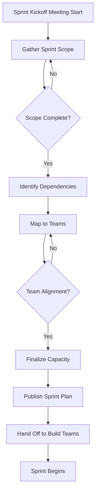

# Plan Phase Example: Sprint Planning Workflow Bundle

## Metadata

- **Bundle ID**: `bundle-plan-sprint-001`
- **SDLC Phase**: `plan`
- **Audience**: `engineering`
- **Maturity**: `pilot`
- **Entity Type**: `workflow`
- **Constraints**: 45-minute timebox for sprint planning kick-off
- **Source References**:
  - `skills/sprint-planner/SKILL.md`

## Diagram

## Click-Through Walkthrough

### Goal

Guide engineering leads through sprint planning preparation and team capacity
alignment so sprints start with clear scope, dependencies mapped, and capacity
confirmed.

### Steps

1. **Gather Sprint Scope** — Review prioritized backlog items, confirm business goals,
   and agree on high-level scope for the sprint. Decision point: Are all priority-one
   items clear? Do we need clarification from product?

2. **Identify Dependencies** — Cross-reference scope items to find inter-team
   dependencies, external blockers, and infrastructure prerequisites. Action:
   Surface each dependency to dependent teams for acknowledgment.

3. **Map to Teams** — Assign scope items to team owners, confirm team leads
   acknowledge ownership. Decision point: Is capacity sufficient? Do we need to
   rebalance or scope down?

4. **Finalize Capacity** — Confirm planned PTO, meetings, and incident response
   bandwidth. Adjust committed scope if needed. Decision point: Is the team
   comfortable with the plan?

5. **Publish Sprint Plan** — Document the agreed scope, dependencies, capacity
   notes, and known risks in the sprint issue or tracking tool. Handoff: All teams
   have the plan 24 hours before sprint start.

6. **Hand Off to Build Teams** — Each team receives their portion of the sprint plan
   and begins development task breakdown. Entry signal for build phase.

### Review Prompts

- What must be true before the planning meeting starts? (e.g., backlog is
  prioritized, participants are confirmed)
- Which dependency check should we verify first? (e.g., do we have API contracts
  from other teams?)
- What blockers should escalate above the planning meeting?
- Who must approve the final plan before it's considered locked?

### Handoff Summary

- **To**: Build teams, tech leads, dependent teams
- **Evidence needed**: Signed-off sprint plan with scope, dependencies, and capacity confirmed
- **Next phase**: Implement (build)
- **Exit signal**: Sprint plan is published and no new blocking dependencies emerge in the 24 hours before sprint start

---

## Video Script (60-120 seconds)

**Scene 1: Preparation** (15 seconds)

"Before sprint planning begins, we review the prioritized backlog with product and
confirm what we're trying to accomplish this sprint."

**Scene 2: Dependencies** (20 seconds)

"Next, we identify cross-team dependencies. If our scope depends on another team's
API, we confirm they're building it on schedule. We also check for infrastructure
or third-party blockers."

**Scene 3: Capacity Mapping** (20 seconds)

"We map scope items to team owners and cross-check against planned time off,
meetings, and incident response capacity. If the math doesn't work, we rebalance
or descope."

**Scene 4: Decision Gate** (15 seconds)

"The tech leads review the plan together. If all leads agree we can deliver it
safely, we lock it in. If there's risk, we raise it now before work starts."

**Scene 5: Handoff** (15 seconds)

"Once locked, the sprint plan goes to all teams. Each team breaks down their
assigned scope into development tasks, and we're ready to start building tomorrow
morning."

**Closing** (10 seconds)

"Clear sprint scope, mapped dependencies, and confirmed capacity mean fewer
surprises during the week. That's sprint planning."

---

## Deck Outline

### Slide 1: Sprint Planning Overview

- Title: "Sprint Planning: Scope → Capacity → Team Alignment"
- Key point: Planning reduces mid-sprint scope changes and dependency surprises
- Proof point: (Example metric: 95% of sprints with complete dependency mapping finish on time - cite source if available)

### Slide 2: Pre-Planning Checklist

- Backlog is prioritized
- Product goals are documented
- Cross-team API contracts are shared
- Team capacity and PTO are known

### Slide 3: The Planning Flow

- Gather scope → identify dependencies → map to teams → confirm capacity →
  publish plan
- Each step has a go/no-go gate

### Slide 4: Dependency Mapping Example

- Show diagram of common cross-team dependencies
- Highlight which teams are on the critical path
- Name the owner responsible for each dependency

### Slide 5: Capacity Confirmation

- Planned capacity vs. committed scope
- Known risks (if any)
- Buffer strategy (if any)

### Slide 6: Sign-Off and Handoff

- Who approved the plan?
- How is it documented?
- When do build teams receive it?

### Slide 7: Success Metrics

- Sprint plan completeness (100% of scope assigned)
- Dependency resolution time (< 4 hours after planning)
- Mid-sprint scope change rate (target: < 5%)

---

## Quality Report Summary

| Criterion | Score | Notes |
|---|---|---|
| **Completeness** | 3/3 | All four artifacts generated |
| **SDLC Alignment** | 3/3 | Phase, audience, and maturity consistent across all |
| **Handoff Clarity** | 3/3 | Entry signal, dependencies, and exit criteria explicit |
| **Consistency** | 2/3 | Core workflow steps present across all artifacts; diagram includes additional dependency handling steps not fully represented in narrative/deck |
| **Rubric Score** | 11/12 | Completeness and alignment strong; consistency requires refinement in future iterations |

---

## Human Review Checklist

- [ ] Terminology matches the team's actual sprint planning process
- [ ] All handoff owners (product, tech leads, team leads) are named
- [ ] Dependencies match the known cross-team structure
- [ ] The 60–120 second video script is realistic for the actual meeting length
- [ ] Deck slides tell a coherent story for an executive audience
- [ ] Source references are sufficient for downstream teams to find details

---

## Next Steps

1. Distribute to sprint planning team lead for review
2. Collect feedback on terminology and gate clarity
3. Use bundle as reference for sprint planning training materials
4. Archive this bundle for future sprint planning onboarding
