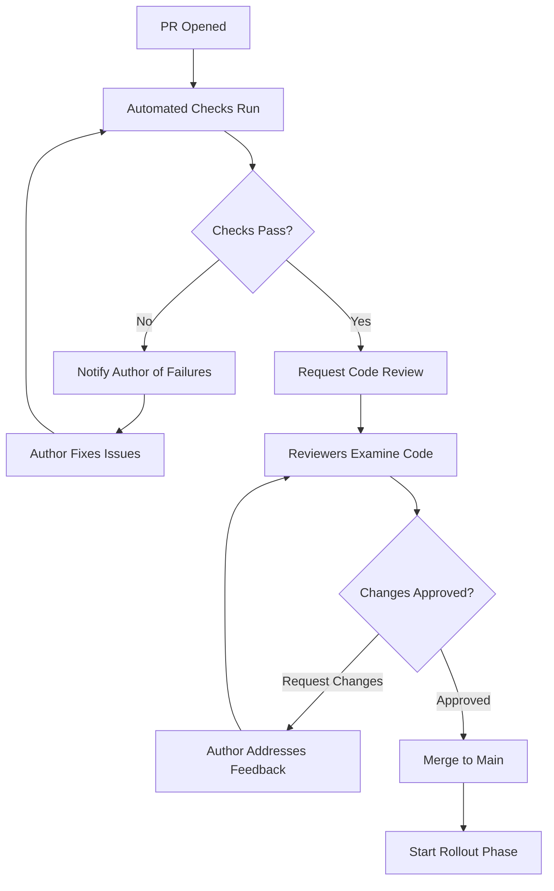

# Validate Phase Example: Code Review Workflow Bundle

## Metadata

- **Bundle ID**: `bundle-validate-code-review-001`
- **SDLC Phase**: `validate`
- **Audience**: `engineering`
- **Maturity**: `pilot`
- **Entity Type**: `skill`
- **Constraints**: 30-minute timebox for PR review, distributed team across timezones
- **Source References**:
  - `skills/code-review/SKILL.md`

## Diagram

## Click-Through Walkthrough

### Goal

Guide reviewers through a systematic code review so changes are assessed for
correctness, maintainability, and adherence to standards before they reach
production.

### Steps

1. **Automated Checks Run** — GitHub Actions validates syntax, linting, and tests.
   Decision point: If automated checks fail, do we need to block the review or let
   the author fix first?

2. **Request Code Review** — Author notifies reviewers with context, test evidence,
   and design rationale. All reviewers should understand: What changed? Why? How
   was it tested?

3. **Reviewers Examine Code** — Each reviewer walks through the changes looking for
   logic errors, performance issues, security risks, and maintainability concerns.
   Reviewers should check: Does the code follow our patterns? Are there edge cases
   not covered by tests?

4. **Approve or Request Changes** — Reviewers either approve or leave feedback.
   Decision point: Is the feedback blocking or advisory? Will the author need to
   resubmit?

5. **Author Addresses Feedback** — Author responds to all comments, makes changes
   if needed, and re-requests review. Decision point: Is the resubmission
   acceptable or does it require another full review?

6. **Merge to Main** — Once approved, the change is merged. Handoff: Code is now
   on main and enters the rollout phase for verification and deployment.

### Review Prompts

- What must be true before a PR is ready for review? (e.g., tests pass, description
  is complete)
- Which types of changes require additional scrutiny? (e.g., security, performance,
  API contracts)
- How long should a reviewer spend on each PR? (e.g., 20-30 minutes)
- What should trigger a "request changes" vs. a comment?

### Handoff Summary

- **From**: Development phase (code is written and tested)
- **To**: Rollout phase (code is merged and ready for deployment verification)
- **Evidence needed**: Approved PR with at least one required review (subject to branch protection policy), all automated checks passing, all reviewer feedback resolved
- **Exit signal**: PR is merged and build completes successfully on main

---

## Video Script (60-120 seconds)

**Scene 1: PR Ready** (10 seconds)

"A developer opens a pull request with their changes. Tests pass, linting passes,
and they've written a clear description of what they changed and why."

**Scene 2: Review Context** (15 seconds)

"As a reviewer, I start by reading the PR description and checking the automated
test results. If tests are passing and there are no lint failures, I know the
basics are good."

**Scene 3: Code Walk-Through** (30 seconds)

"Now I walk through the actual code changes. I'm looking for logic errors, places
where this might break under load, or security issues. I also check: Does this
follow our coding patterns? Are there edge cases not covered by tests?"

**Scene 4: Feedback** (15 seconds)

"If I see an issue, I leave a comment and ask for changes. If the code looks good,
I approve. I might leave suggestions for future improvements, but those don't block
the merge."

**Scene 5: Resolution** (15 seconds)

"The developer sees my feedback, makes changes if needed, and re-requests review.
Once the required approvals are obtained (per branch protection policy), the code
can be merged."

**Closing** (10 seconds)

"Careful code review catches bugs, security risks, and maintainability issues
before they reach production. That's why we do it."

---

## Deck Outline

### Slide 1: Code Review: Why It Matters

- Title: "Code Review: Catching Issues Before Production"
- Key point: Most production issues are caught in code review
- Proof point: (Example metric: 87% of defects caught in review vs. 2% in production - cite source if available)

### Slide 2: Pre-Review Checklist

- Tests pass locally and in CI
- Linting and formatting pass
- PR description explains the change and why
- No merge conflicts
- Author has run manual testing if needed

### Slide 3: The Review Flow

- Automated checks run → request review → reviewer examines → approve or request
  changes → resolve feedback → merge
- Each step has clear gates

### Slide 4: What Reviewers Look For

- **Correctness**: Does the logic work for all cases?
- **Security**: Are there authentication, authorization, or injection issues?
- **Performance**: Any algorithms that might be slow at scale?
- **Maintainability**: Does it follow our patterns? Will future devs understand it?

### Slide 5: Feedback Types

- **Blocking**: Must be fixed before merge (logic error, security risk)
- **Advisory**: Good to consider but doesn't block (style suggestion, future idea)
- **Question**: Need clarification (help me understand this choice)

### Slide 6: Reviewer Responsibility

- Spend 20-30 minutes per PR
- Check tests are comprehensive
- Ensure documentation is clear
- Name specific issues, don't just say "fix this"

### Slide 7: Success Metrics

- Average review time: 24 hours from request to first review
- Average resolve time: 48 hours from feedback to resubmission
- Code review approval rate: > 95% (most PRs approved on first submission)

---

## Quality Report Summary

| Criterion | Score | Notes |
|---|---|---|
| **Completeness** | 3/3 | All four artifacts generated |
| **SDLC Alignment** | 3/3 | Phase, audience, and maturity consistent across all |
| **Handoff Clarity** | 3/3 | Entry signal (PR ready), exit signal (merged), and gate criteria explicit |
| **Consistency** | 2/3 | Core review steps present across all artifacts; diagram includes additional decision nodes not represented in walkthrough/deck narrative |
| **Rubric Score** | 11/12 | Completeness and alignment strong; consistency requires refinement in future iterations |

---

## Human Review Checklist

- [ ] Terminology matches the team's actual code review process
- [ ] Review gates (automated checks, approval count) are clearly stated
- [ ] The 60–120 second video script is realistic for the actual review time
- [ ] Feedback types (blocking vs. advisory) are clear
- [ ] Deck slides tell a coherent story for engineering leadership
- [ ] Source references point to actual style guides and standards

---

## Next Steps

1. Distribute to code review working group for feedback
2. Use as training material for new reviewers
3. Reference in PR templates and onboarding
4. Archive for future reviewer certification
